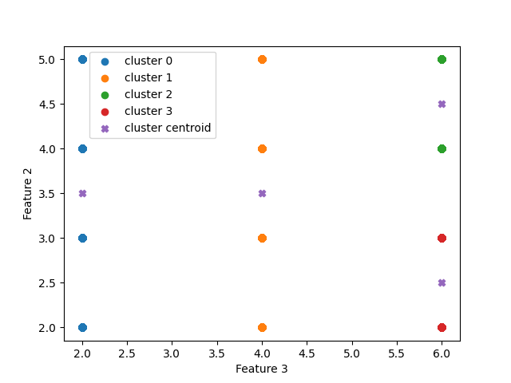

# Probably Interesting Data

### Submission by Benjamin Wyss

Estimating dataset distributions and generating new data points by modeling data as k-means clusters

## Datasets Examined

[Wine Dataset](https://archive.ics.uci.edu/ml/datasets/Wine)

This dataset contains 13 continuous numeric attributes with a target goal of determining which of three cultivars a given wine is derived from.

[Car Evaluation Dataset](https://archive.ics.uci.edu/ml/datasets/Car+Evaluation)

This dataset contains 6 discrete string attributes with a target goal of determining which of four acceptability classes a given car belongs to. For this project, discrete string attributes are converted to discrete numeric attributes so that there exists a notion of numeric distance between data points. Examine [carDataToNumeric.py](https://github.com/benjaminwyss/EECS738ProbablyInterestingData/blob/main/carDataToNumeric.py) to see how [data/car.data](https://github.com/benjaminwyss/EECS738ProbablyInterestingData/blob/main/data/car.data) is converted to [data/carNumeric.data](https://github.com/benjaminwyss/EECS738ProbablyInterestingData/blob/main/data/carNumeric.data).

## The Big Idea

The k-means algorithm groups data points together based on closeness of features. I hypothesize that the examined datasets will have clusters of points that are similarly distributed, and as such k-means can model the datasets as distinct clusters of similar points. Using the determined clusters, new data points can be generated by calculating the value of a random variable that is either discrete or continuous within the feature ranges of a given cluster.

## Process

The k-means algorithm is implemented in [kmeans.py](https://github.com/benjaminwyss/EECS738ProbablyInterestingData/blob/main/kmeans.py). The file includes methods to fit clusters to a given dataset, predict the clusters of additional data, and generate new data points--either continuous or discrete. The main driver code is located in [main.py](https://github.com/benjaminwyss/EECS738ProbablyInterestingData/blob/main/main.py), and is responsible for reading in a given dataset, fitting k-means clusters for the dataset, generating new data points, and plotting the results (The x and y axis of the generated plot are determined to be the two features which have the greatest average intercluster distance). To determine the dataset's number of clusters (k), the first column of the dataset is treated as the data's classes, thus k is determined to be the number of unique values within the dataset's first column. To run the project, execute the main file in the following format:

`py main.py <path_to_dataset> <newly generated data mode--options are: continuous|discrete|none>`

The last argument is used to determine how new data points will be generated. Use 'none' to not generate any new data points, 'continuous' if the dataset contains continuous numeric features, and 'discrete' if the dataset contains discrete numeric features.

## Results

Using k-means clusters to model the distributions within a dataset relies on the assumption that data points belonging to the same class are close together in *distance*. This assumption holds well for datasets like the [Wine Dataset](https://archive.ics.uci.edu/ml/datasets/Wine), but less so for datasets like the [Car Evaluation Dataset](https://archive.ics.uci.edu/ml/datasets/Car+Evaluation).

Here is the actual class distribution of the wine dataset:

And this shows how data points are clustered by the k-means algorithm:

While the clusters are not perfect at modeling the distributions of each category of wine, they provide pretty good estimates of the distributions within each class. In a given cluster, continuous random variables can be generated to form new data points. The graph below shows the original data and clusters alongside 10 artificially generated data points.

As can be seen, the artifically generated datapoints would be easy to pass off as legitimate if they were unlabeled.

Let's now examine the car dataset. Here is the actual class distribution within the dataset:

Because this data is categorical and has limited possible values, the selected two graphing features cannot be used to distinguish all of the different classes. Despite this, the k-means algorithm will make additional distinctions between data points in forming clusters as pictured below:

While the generated clusters certainly appear to be distinct, k-means made distinctions that were not present in the original dataset. Despite the imperfect clustering results, discrete random variables can be generated within clusters to create new data points. The graph below shows the original data and clusters alongside 10 artificially generated data points.

Once again, the artificially generated datapoints appear to be legitimate.

One interesting observation with the car dataset in particular is that every time the k-means algorithm is run, slightly different clusters appear to be generated. This is because my implementation of the k-means algorithm selects initial cluster centroid locations randomly, and with the small amount of variance in the car dataset's categorical values, this tends to generate a locally optimal clustering with cluster locations depending on where the initial cluster centroids are placed.

## Conclusions

Overall, I have found that the k-means algorithm's data modeling performance is highly dependent on the dataset used. I have shown an example where k-means data modeling performs very well, and another example where the algorithm has some issues. These issues could likely be mitigated by further transforming categorical datasets so that the most class-distinct features are seperated by greater distance, or perhaps by generating k-means clusters with a metric other than euclidean distance like was used in my implementation. While I believe that these results have shown overall success, I conclude by noting that there will always be room for worthwhile improvement which I have outlined above.
